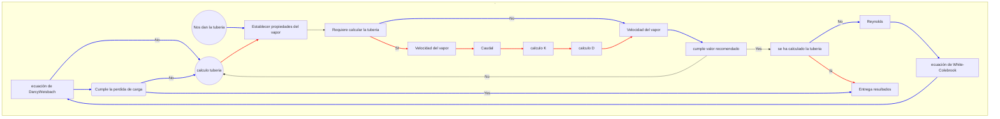

# Optativas
Primero antes que nada sera necesari

```mermaid
flowchart TD
    I -- No --> A2
    E -- No --> A2

    subgraph '
        B((Nos dan la tuberia));
        A2((calculo tuberia)):::blue;
        B --> C[Establecer propiedades del vapor]:::red;
        C -->C3[Requiere calcular la tuberia];
        C3 -- No --> D[Velocidad del vapor];
        C3 -- SI --> C2[Velocidad del vapor];
        D --> E[cumple valor recomendado];
        E -- Yes --> H2[se ha calculado la tuberia];
        H2 -- No --> H[Reynolds];
        H2 -- Si --> Z[se ha calculado la tuberia];
        H --> G[ecuación de White-Colebrook];
        G --> I[ecuación de DarcyWeisbach];
        I --> J(Cumple la perdida de carga) ;
        J -- Yes --> Z[Entrega resultados];
        J -- No --->A2;
        
        A2 --> C:::blue;
   
        C2 --> D2[Caudal];
        D2 --> e2[calculo K];
        e2 --> F2[calculo D];
        F2 --> D;
        
    end
linkStyle 2 stroke-width:2px,fill:none,stroke:blue;
linkStyle 0 stroke-width:2px,fill:none,stroke:blue;
linkStyle 4 stroke-width:2px,fill:none,stroke:blue;
linkStyle 6 stroke-width:2px,fill:none,stroke:blue;
linkStyle 8 stroke-width:2px,fill:none,stroke:blue;
linkStyle 10 stroke-width:2px,fill:none,stroke:blue;
linkStyle 11 stroke-width:2px,fill:none,stroke:blue;

linkStyle 12 stroke-width:2px,fill:none,stroke:blue;
linkStyle 13 stroke-width:2px,fill:none,stroke:blue;
linkStyle 14 stroke-width:2px,fill:none,stroke:blue;
linkStyle 15 stroke-width:2px,fill:none,stroke:red;
linkStyle 16 stroke-width:2px,fill:none,stroke:red;
linkStyle 17 stroke-width:2px,fill:none,stroke:red;
linkStyle 18 stroke-width:2px,fill:none,stroke:red;
linkStyle 19 stroke-width:2px,fill:none,stroke:red;
linkStyle 5 stroke-width:2px,fill:none,stroke:red;
linkStyle 9 stroke-width:2px,fill:none,stroke:red;
    
```
